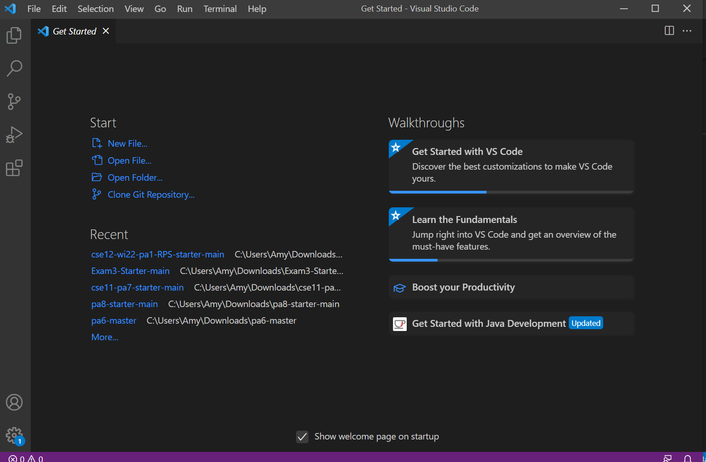
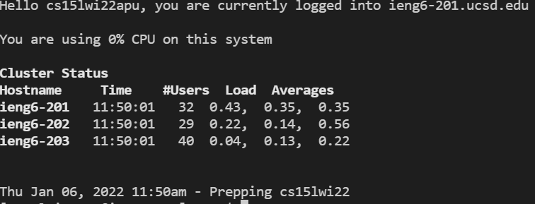
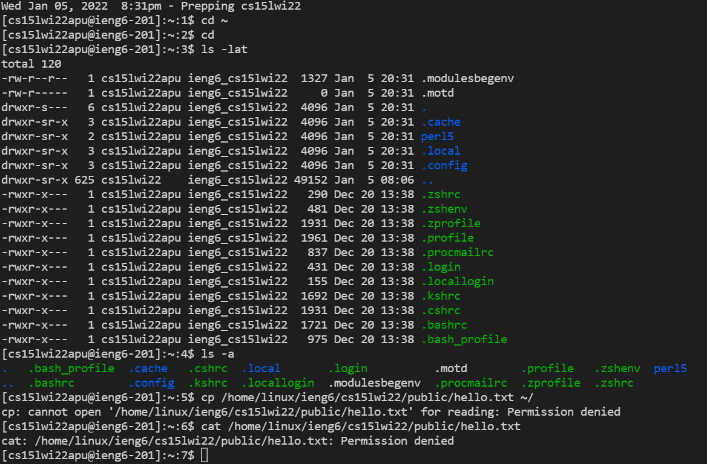
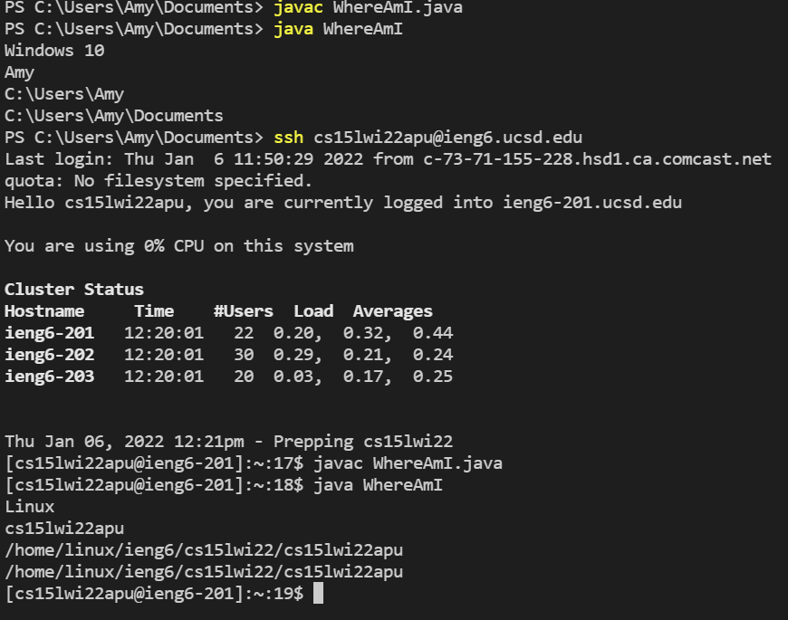
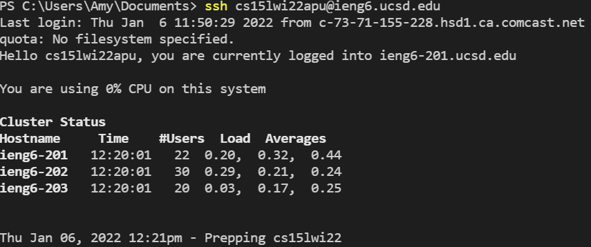
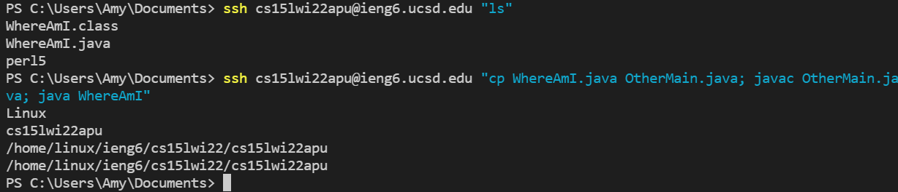

# Installing VScode

I already had VScode installed. When you open the application, the above window appears. To open an existing project, click the "open folder".

---
# Remotely Connecting
* install ssh client/server:
[Link](https://docs.microsoft.com/en-us/windows-server/administration/openssh/openssh_install_firstuse)
* enter `ssh cs15lw22apu@ieng.ucsd.edu`. Use this [Link](https://sdacs.ucsd.edu/~icc/index.php) to look up your username if necessary
* enter password. the text will not show up. hit enter

* the list of available host computers will be displayed (like above)

---
# Trying Commands

**Basic Commands**
* cd: takes you to the specified directory
* ls: shows the files in the folder
* ls -lat: shows the files in the directory with additiona information
* ls -a: shows additional files in the directory

---
# Moving Files with scp

* create/edit a file on your client device, save changes
* without signing in to the remote server, enter `scp <path to file on your computer> <enter username + folder path or :\~> `
* enter password

---
# Setting an SSH Key

* for windows enter `ssh-keygen -t ed25519`
* when prompted to enter the file to save the key enter `<path to .ssh folder>/id_rsa`
* do not create an id_rsa file before the above step
* ssh into the remote server and us `mkdir` to create a .ssh folder in the remote server
* move the public key file to the `.ssh` remote server using `scp` (you will need to enter your password)
* you should now be able to `ssh` and `scp` without entering your password

---
# Making Remote Running More Efficient

`ssh cs15lwi22apu@ieng.ucsd.edu "<command, separated with semicolons if there are multiple>"`

this will ssh into the remote server, run the commands, then logout

**Optimized Process:**
1. set an ssh key
2. make changes and save file
3. copy and paste `ssh cs15lwi22apu@ieng.ucsd.edu "scp <path to file on your computer> <enter username + folder path or :\~>"` or use up arrows to copy last command (if rerunning several times)

# Link to Lab Instructions
[Link](https://ucsd-cse15l-w22.github.io/week/week1/)
