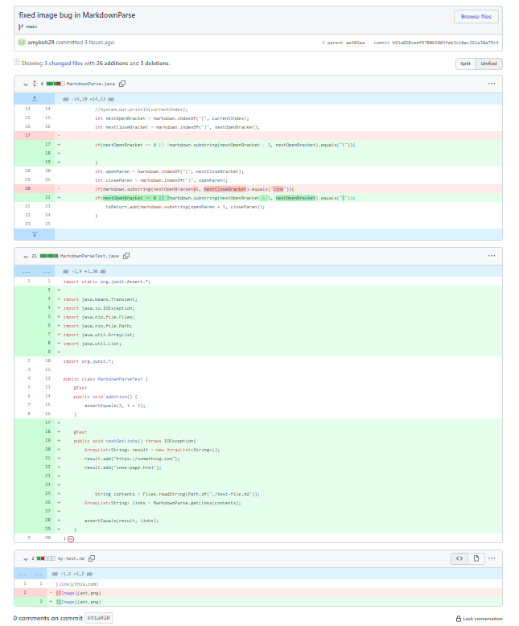
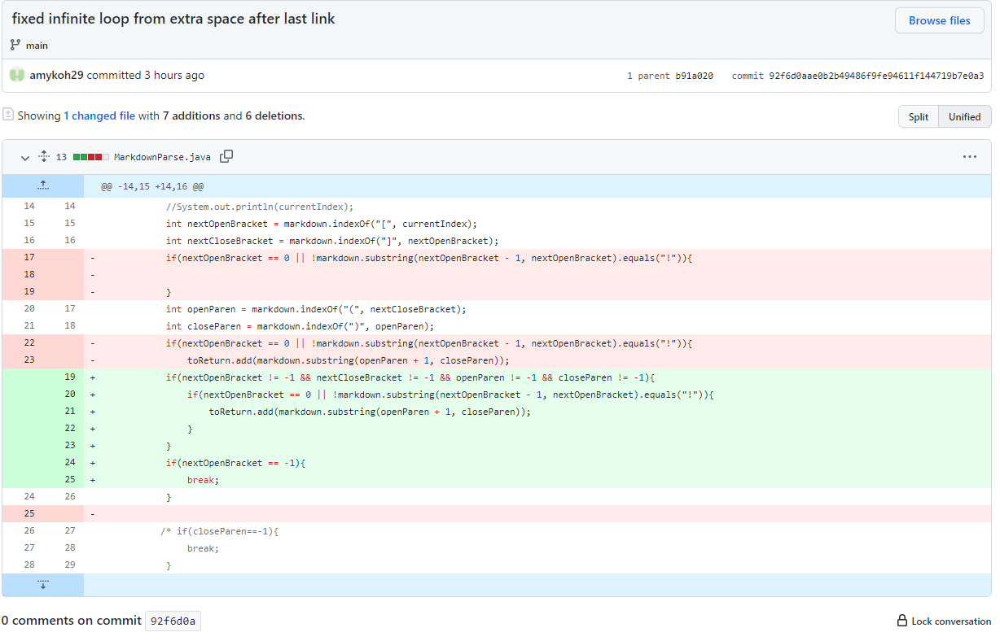
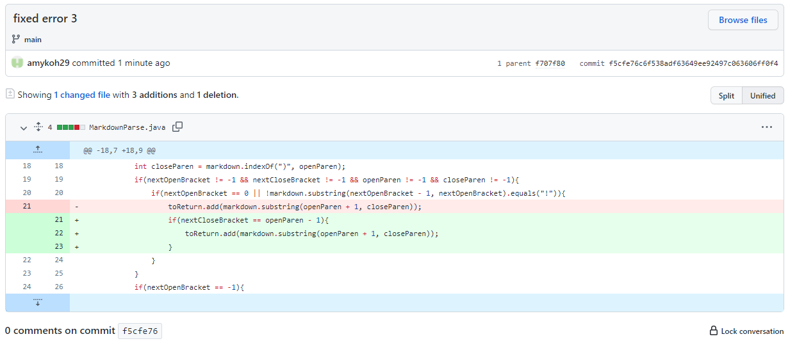

# Issue 1: Image Links

**Input File:** [my-test.md](https://github.com/ahkoh29/markdown-parse/blob/main/my-test.md?plain=1)

**Symptom:**
Output: `[something.com, ant.png]`

Expected: `[something.com]`

**Code Changes**

**Description**

When we included an image file, the program would include the link of to the image in the return statement. This was not the expected output becaus the programs was intended
to only return web links. To fix this we checked if the nextOpenBracket was the first character, if it was we added the link to the return string. If not, we cheacked that the 
character before the nextOpenBracket was equal to "!", if it was, we wouldn't add the link to the returned string.

---

# Issue 2: Text After Last Link

**Input File:** [my-test-2.md](https://github.com/ahkoh29/markdown-parse/blob/main/my-test-2.md?plain=1)

**Symptom:**
Output: 
`Exception in thread "main" java.lang.OutOfMemoryError: Java heap space`

**Code Changes**

**Description**
When there is any kind of character after the last link in the markdown file, the program goes into an infinite loop. This is because the value of nextOpenParen is 
-1 because indexOf returns -1 when there is no instance of the string. At the end of the loop, currentIndex becomes nextOpenParen + 1 which = 0. However, the while
loop continues running because the value of currentIndex will keep being set to 0 and length of the string is greater than 0. To fix this bug, we checked if the
indices of any of the brackets was equal to -1, if so we would break out of the loop.

---

# Issue 3: Characters Between [] and ()

**Input File:** [my-test-3.md](https://github.com/ahkoh29/markdown-parse/blob/main/my-test-3.md?plain=1)

**Symptom:**
Output: 
`[end.com]`

Expected:
'[]'

**Code Changes**

**Description**

When tested a file that had characters between the square brackets and the parentheses, the program would still return the link in the parentheses, even though 
the markdown file does not format it as a link. To fix this bug we checked that the index for the openParen was right after the index of the nextClosedBracket, if
it was then we added the link to the String, otherwise we didn't
