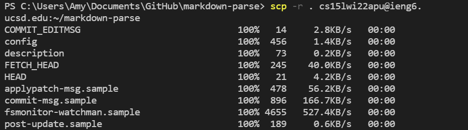
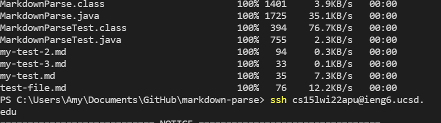
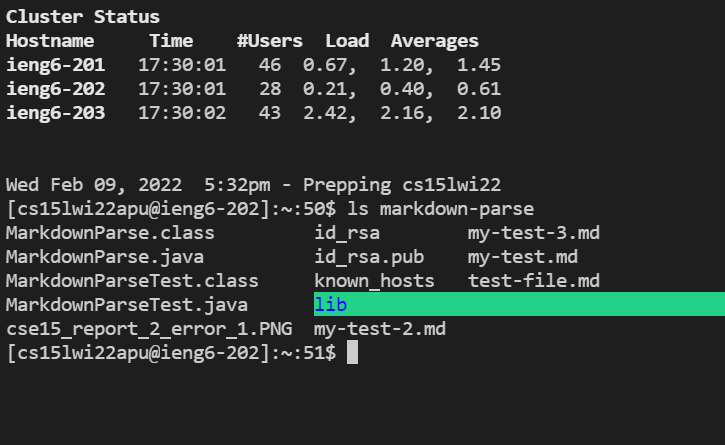
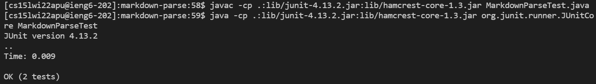
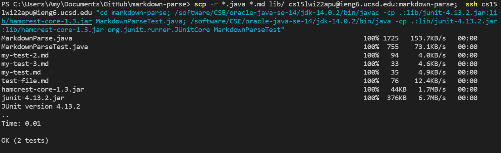

# scp A Whole Directory #

**Copy a Directory**

1. cd into the directory
2. `scp -r . cs15lwi22apu@ieng6.ucsd.edu:~/<name of directory to be copied to>`

All the .git files will be copied

The files in the directory will be copied as well

**See and Run the Files**
1. `ssh cs15lwi22apu@ieng6.ucsd.edu`
2. To see the files: `ls <directory name>`

4. To run files: 
`cd <directory name>`
`javac -cp .:lib/junit-4.13.2.jar:lib/hamcrest-core-1.3.jar <file name>`
`java -cp .:lib/junit-4.13.2.jar:lib/hamcrest-core-1.3.jar org.junit.runner.JUnitCore <class name>`

**Streamlined Cammand Running**
1. `scp -r *.java *.md lib/ cs15lwi22apu@ieng6.ucsd.edu:~/<name of directory to be copied to>; ssh cs15lwi22apu@ieng6.ucsd.edu "cd <directory name>; /software/CSE/oracle-java-se-14/jdk-14.0.2/bin/javac -cp .:lib/junit-4.13.2.jar:lib/hamcrest-core-1.3.jar <file name>; /software/CSE/oracle-java-se-14/jdk-14.0.2/bin/java -cp .:lib/junit-4.13.2.jar:lib/hamcrest-core-1.3.jar org.junit.runner.JUnitCore <class name>` 

Using `*.java *.md lib/` instead of ` . ` copies only the `.java` and `.md` files, and `lib/` folders
