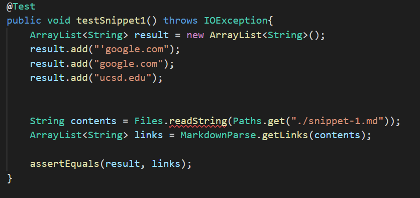
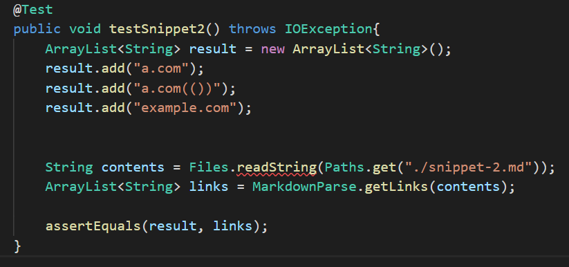
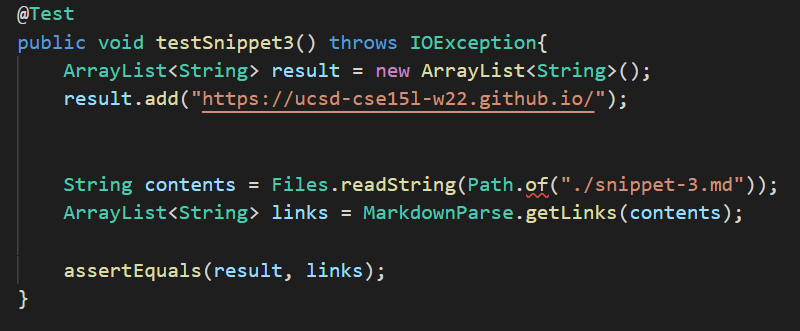
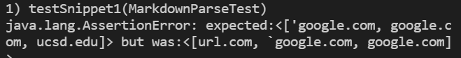
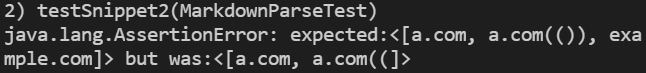
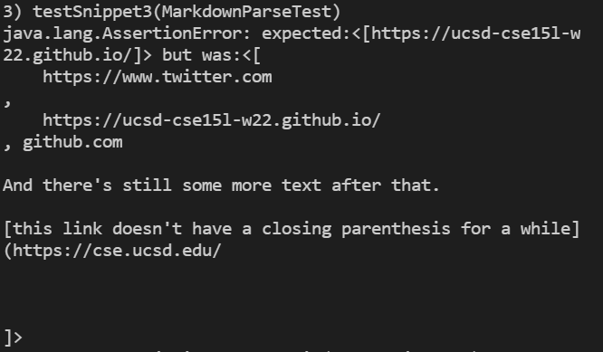
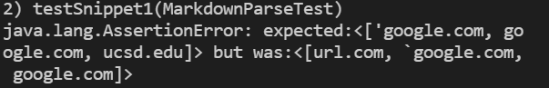
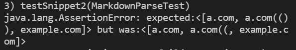
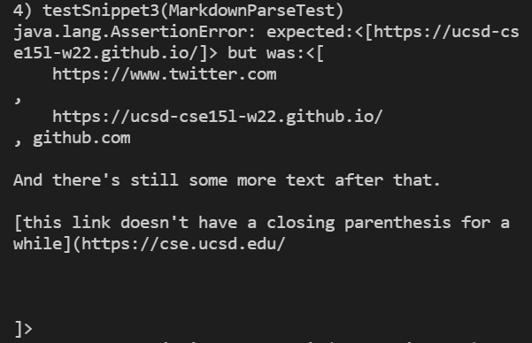

## Test Files ##

**Junit Tests**

## My Markdown Parse ##

**Snippet 1 Test**

**Snippet 2 Test**

**Snippet 3 Test**

## Other Markdown Parse ##

**Snippet 1 Test**

**Snippet 2 Test**

**Snippet 3 Test**

## Questions ##

1. I think this issue would be more involved. a potential solution for the issue of backticks could be to check that there is an even number of back ticks before the first bracket and after the closing parentheses,
also check that there are an even number of back ticks between the brackets and between the parentheses. However, we would also need to make sure to ignore code between pair of back ticks when checking for brackets
and parentheses

2. A potential small code change for the issue of nested parentheses and brackets could be to use a stack as we discussed in cse 12. Using a loop, each time we encounter an open parentheses or bracket
we push it onto the stack, whenever we find a closing parentheses/bracket we pop from the stack and check that the two are matching. If they are not, or the stack is empty, discard the link.

3. I think a small code change that could fix the issue would be to check for the '\n' character when looking for the closing parentheses or bracket. If one is found before the closing
bracket, discard the potential link.
