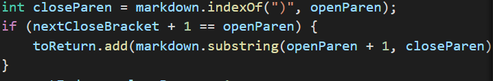

## Files ##

To find files with different outputs, I manually scrolled through the results.txt files from my group's repository 
and the provided repository and looked for the row numbers that were different. I chose to look at files 481.md and 494.md

**File 481.md**
contents: `[link](/uri "title")`

My Output: `[/uri "title"]`

Other Output: `[]`

Expected Output: `[/uri]`

Neither implementation is correct. To fix my group's implementation, we would need to add a check for quotation marks.

In this section of code, instead of using the index of the close parentheses as the last index, we should check the indexOf
a quotation mark, if it isn't -1 we should use it as the last index of the substring.

**File 494.md**
contents: '[link](\(foo\))'

My Output: `[\(foo\]`

Other Output: `[\(foo\)]`

Expected Output: `[\(foo\)]`

The provided implementation is correct. To fix my group's implementation we should check for the last parentheses before a
newline character or an open bracket character.

In this section of code, instead of setting closeParen as the first ")" after the openParen, we should check for the index of
the next `\n` or `[` character after openParen, if either or both are not -1 then find the last `)` character before the
`\n` or `[` that comes first.
